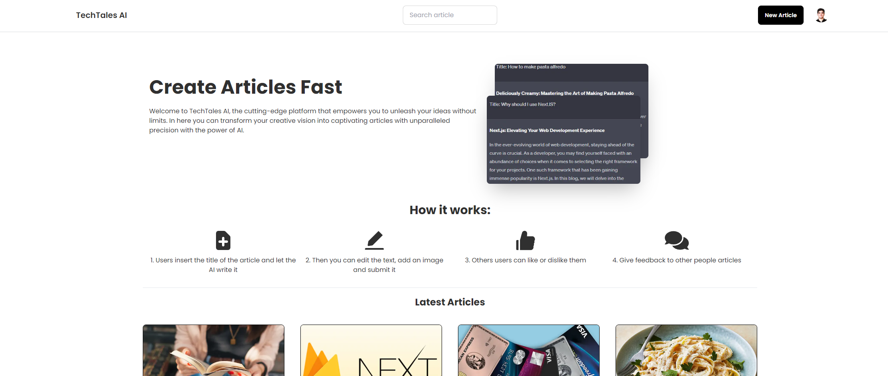

# Portfolio

## Description

This is a page where users can create articles with AI by only writing the Title and let the AI generate all the content.

- It is using NextJS and tailwindcss with some plugins for animations.
- It is using a free API from [OpenAI](https://openai.com/) to generate the content.
- For the backend it is using Prisma with a mongodb.

If you want to see it in real time use this url: https://techtales-ai.vercel.app/
